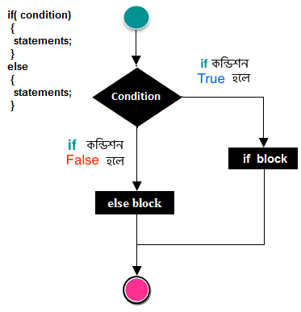

# if-else স্টেটমেন্ট

আমরা পূর্বের পর্বে জেনেছি সি প্রোগ্রামিং এর if-statement নিয়ে। এই পর্বে আমরা সি প্রোগ্রামিং এর ডিসিশন মেকিং স্টেটমেন্টের if- else statement নিয়ে বিস্তারিত আলোচনা করব।

সি প্রোগ্রামিং এ if-else কে ডিসিশন মেকিং স্টেটমেন্ট বলে। if- else স্টেটমেন্টের ক্ষেত্রে যদি প্রোগ্রামের কন্ডিশন বা test expression সত্য হয় তাহলে প্রোগ্রামের ব্লক স্টেটমেন্ট এক্সিকিউট হবে আর যদি কন্ডিশন মিথ্যা হয় তাহলে অন্য একটি ব্লক এক্সিকিউট হবে যাকে আমরা else statement বলে থাকি। else স্টেটমেন্টে কোনো কন্ডিশন থাকে না মানে একে আমরা অন্যথায় বা অপশনাল হিসেবে ব্যবহার করি।

#### if- else স্টেটমেন্ট এর সিনট্যাক্স

```c
if(condition)
{
  statements
}else
{
  statements
}
```

#### ব্যবহার

আমরা if- else স্টেটমেন্ট দিয়ে ছোট একটা প্রোগ্রাম করি-

```c
#include <stdio.h>

int main()
{
    int time = 9;
    
    if(time<12)
    {
        printf("শুভ সকাল! \n");
    }else
    {
        printf("শুভ সন্ধ্যা!  \n");
    }

    return 0;
}
```

#### আউটপুট

```c
শুভ সকাল!
```

এখানে একটি if- else এর প্রোগ্রাম দেখানো হয়েছে। যদি সময় 12 টার কম হয় তাহলে 'শুভ সকাল!' আবার যদি সময় ১২ টার বেশি হয় তাহলে 'শুভ সন্ধ্যা!' প্রিন্ট করবে।

#### if- else স্টেটমেন্টের ফ্লোচার্ট



#### if- else স্টেটমেন্ট ব্যবহার করে নিচে কিছু উদাহরণ দেওয়া হলো-

কোনো সংখ্যা জোড় না বেজোড় তা নির্ণয় করার জন্য if- else ব্যবহার করা হয়। যেমন-

```c
#include <stdio.h>

int main()
{
    int number;
    
    printf("Enter a Number: ");
    scanf("%d", &number);
    
    if(number % 2  == 0)        //if statement 
    {
        printf("Even Number! \n");
    }else                       //else statement 
    {
        printf("Odd Number! \n");
    }

    return 0;
}
```

#### আউটপুট

```c
Enter a Number: 11
Even Number!
```

কোনো সংখ্যা ছোট না বড় তা নির্ণয় করার জন্য if- else ব্যবহার করা হয়। যেমন-

```c
#include <stdio.h>

int main()
{
    int x, y;
    
    printf("Enter 2 Number: ");
    scanf("%d %d", &x, &y);
    
    if(x > y)        //if statement 
    {
        printf("%d is Bigger than %d! \n", x, y);
    }else                       //else statement 
    {
        printf("%d is Bigger than %d! \n", y, x);
    }

    return 0;
}
```

#### আউটপুট

```c
Enter 2 Number: 1 45
45 is Bigger than 1!
```

