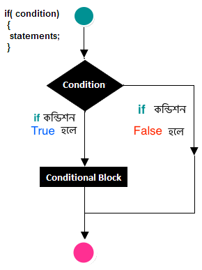

# if স্টেটমেন্ট

আমরা পূর্বের পর্বে জেনেছি সি প্রোগ্রামিং এর অপারেটর নিয়ে। এই পর্বে আমরা সি প্রোগ্রামিং এর ডিসিশন মেকিং স্টেটমেন্টের if-statement নিয়ে বিস্তারিত আলোচনা করব।

শর্ত সাপেক্ষে কোন স্টেটমেন্ট সম্পাদনের জন্য if statement ব্যবহৃত হয়। অর্থাৎ আমাদের প্রোগ্রামের কন্ডিশন বা test expression যদি সত্য হয় তাহলে প্রোগ্রামের স্টেটমেন্ট এক্সিকিউট হবে আর কন্ডিশন যদি মিথ্যা হয় তাহলে প্রোগ্রামের স্টেটমেন্ট এক্সিকিউট হবে না।

#### if স্টেটমেন্ট এর সিনট্যাক্স

```c
if(condition)
{
  statements
}
```

#### **ব্যবহার**

```c
int a=1;
int b=2;

if(a<b)		//test-condition
	{
		printf("a is smaller than b");
	}
```

#### if স্টেটমেন্টের ফ্লোচার্ট



if স্টেটমেন্ট ব্যবহার করে নিচের প্রোগ্রামটি দেওয়া হয়েছে, কিভাবে পজিটিভ নাম্বার নির্ণয় করতে হয়।

```c
#include<stdio.h>

int main()
{
    int a;
    printf("Enter a number: ");
    scanf("%d",&a);
    
    if(a>0)
    {
       printf("Positive Number!");
    }
    
   return 0;
}
```

#### আউটপুট

```c
Enter a number: 3 
Positive Number!
```

#### ব্যাখ্যা 

উপরের প্রোগ্রামটি হচ্ছে কিভাবে আপনি পজিটিভ নাম্বার বের করবেন। এখানে যেহেতু শুধু if স্টেটমেন্ট ব্যবহার করা হয়েছে তাই আপনার ইনপুট দেওয়া নাম্বার যদি পজিটিভ ভেল্যু হয় তাহলেই সে রিটার্ন বা আউটপুট দিবে অন্যথায় সে স্টেটমেন্টে ঢুকবে না। 

নিচের সি প্রোগ্রামটি লক্ষ্য করুন- 

```c
#include <stdio.h>

int main()
{
   int age;
   
   printf("Enter your age: ");
   scanf("%d",&age);
   
   if(age >=18)
	    printf("আপনি ভোটার হতে পারবেন!");
   else
	    printf("আপনি ভোটার হতে পারবেন না! ");
	
   return 0;
}
```

#### আউটপুট

```c
Enter your age: 17 
আপনি ভোটার হতে পারবেন না!
```

#### ব্যাখ্যা 

এখানে আপনি যদি ১৮ বছর অথবা তার বেশি হোন তাহলেই কেবল আপনি ভোট দিতে পারবেন অন্যথায় পারবেন না। 

