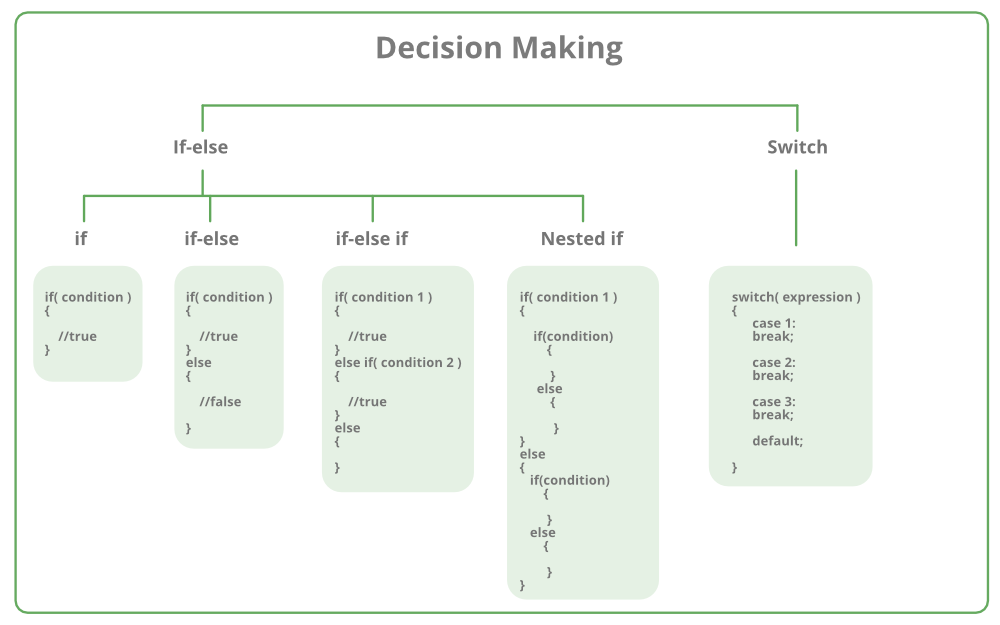

# প্রাথমিক ধারণা

সি প্রোগ্রামিং এ অনেক গুরুত্বপূর্ন বিষয় হচ্ছে ডিসিশন মেকিং বা কন্ট্রোল স্টেটমেন্ট। আমরা জানি পৃথিবীর প্রত্যেকটা প্রোগ্রামিং ভাষায় শর্তসাপেক্ষে কাজ করে। আর প্রোগ্রামিং ব্যাপারটাই হচ্ছে লজিক্যাল। আর এই লজিকগুলোকে কাজে লাগিয়েই বর্তমানে আমরা একটা ভার্চুয়াল বিশ্বে বসবাস করছি।

সি প্রোগ্রামিং এ এই লজিক্যাল স্টেটমেন্ট গুলো সম্পাদনের জন্যই কন্ট্রোল স্টেটমেন্টস \(Control Statements\) জিনিসটা ব্যবহার করা হয়। অর্থাৎ আপনি কি ধরনের আউটপুট চাচ্ছেন তা পুরো টাই নির্ভর করে এই কন্ট্রোল স্টেটমেন্টস এর উপর।

আমরা আমাদের দৈনন্দিন জীবনে প্রচুর কন্ট্রোল স্টেটমেন্টস এর ব্যবহার করে থাকি। যেমন ধরুন- আমার ক্ষুদা লাগলে আমি প্রচুর খাই, ঘুম আসলে প্রচুর ঘুমাই, নামাজের সময় হলে নামাজে যাই, শুক্রবারে মসজিদে প্রচুর মুসল্লিদের দেখতে পাই, অন্যদিনে তাদের তেমন কোনো আগ্রহ নাই। এই যে এখানে আমার কেবল ক্ষুদা লাগলেই আমি খাই, অথবা ঘুম আসলেই কেবল ঘুমাই নতুবা নামাজের সময় হলেই কেবল নামাজে যাই। এখানে কত গুলো কন্ডিশন কাজ করে যদি আমার ক্ষুদা না লাগতো তাহলে আমি খেতাম না, আমার ঘুম না আসলে আমি ঘুমাতাম না, আমার নামাজের সময় না আসলে আমি নামাজে যেতাম না।

ঠিক একইভাবে আমরা যদি এই সমস্যা গুলো প্রোগ্রামিং দিয়ে কাউকে বুঝাতে চাই তখন আমরা কন্ট্রোল স্টেটমেন্টস এর ব্যবহার করবো। অর্থাৎ আমাদের শর্ত যদি সত্যি হয় তাহলে সে এক রকম কাজ করবে আবার আমাদের শর্ত যদি মিথ্যা হয় তাহলে সে আরেক রকম কাজ করবে।

আমরা আমাদের এই কোর্সের প্রথম দিকে কিছু সাধারণ ডেটা নিয়ে কাজ করেছি। কিন্তু সেখানে তেমন কোনো লজিক্যাল কোড ছিল না, এখন আমরা যদি তিনটি সংখ্যার মধ্যে বড় সংখ্যা কোনটি, ছোট সংখ্যা কোনটি অথবা কোনটি জোড় সংখ্যা, কোনটি বিজোড় সংখ্যা নতুবা একটা নির্দিষ্ট কমান্ড আসলে, একটা নির্দিষ্ট আউটপুট দিতে হবে। এই ধরণের কাজ গুলোর জন্যই আমরা এই অধ্যায়ে কন্ট্রোল স্টেটমেন্টস সম্পর্কে জানবো।

সি তে বিভিন্ন ধরণের ডিসিশন মেকিং স্টেটমেন্ট রয়েছে-

* [if স্টেটমেন্ট ](https://c.techsajib.com/c-decision-making/if-statement)
* [if-else স্টেটমেন্ট ](https://c.techsajib.com/c-decision-making/if-else-statement)
* [if- else Ladder স্টেটমেন্ট ](https://c.techsajib.com/c-decision-making/if-else-ladder)
* [nested if স্টেটমেন্ট ](https://c.techsajib.com/c-decision-making/nested-if-statement)
* [switch স্টেটমেন্ট ](https://c.techsajib.com/c-decision-making/switch-statement)

সি ডিসিশন মেকিং স্টেটমেন্ট এর সিনট্যাক্সগুলো-

বলা হয়ে থাকে, কন্ট্রোল স্টেটমেন্ট নিয়ে যে যত ভাল বুঝতে পারবে, সে প্রোগ্রামিং তত ভাল করতে করবে। 

